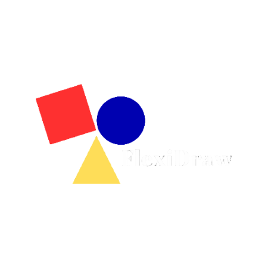
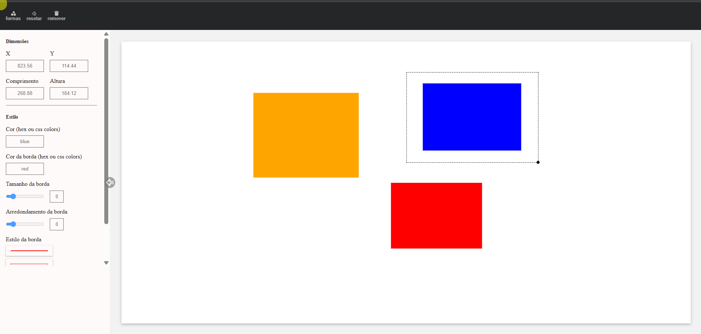

# 🎨FlexiDraw

  

  
  
  

## [De uma olhada](https://flexi-draw.vercel.app/)

O Flexidraw é um aplicativo de quadro branco digital desenvolvido com React + Vite, permitindo a criação, manipulação e personalização de formas de maneira intuitiva. Utilizando a biblioteca use-gesture, o app possibilita interações fluidas, como redimensionamento, movimentação e estilização de elementos.

## ✨Recursos  
✔️ Adicione formas geométricas ao quadro branco  
✔️ Redimensione e mova os elementos livremente  
✔️ Personalize cores, bordas e estilos  
✔️ Experiência fluida e responsiva  

## 🛠️Tecnologias utilizadas  
🚀 React + Vite    
🖱️ use-gesture para interações naturais  
🎨 CSS/Styled-components para estilização  

